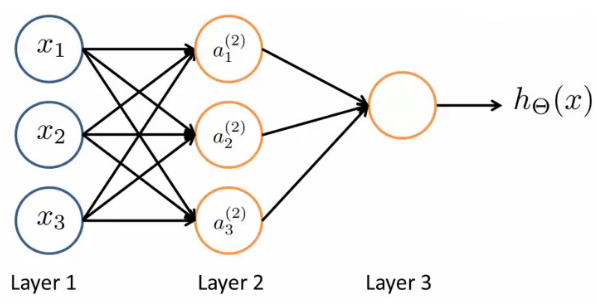

Neural networks are a series of stacked layers. Deeper the network, higher the number of layers. Layer 1 is called the **input layer** and Layer 3 is called the **Output layer**. The intermediate layer are called the hidden layer. The number of hidden layer might vary depending on the network complexity. In this case, Layer 2 is the hidden layer. 
$$
x = \begin{bmatrix}
x1 \\
x2 \\
x3 \\
\end{bmatrix}
$$

$$
\theta = \begin{bmatrix}
\theta_1 \\
\theta_2 \\
\theta_3 \\
\end{bmatrix}
$$

$$
a = g( \theta^T * x )
$$
g is the activation function . x is the input vector . a is the activation output.

$$
a^{(2)}_1 = g( \theta^{(1)}_{10} x_0  + \theta^{(1)}_{11} x_1 + \theta^{(1)}_{12} x_2 + \theta^{(1)}_{13} x_3)
$$

$$
a^{(2)}_2 = g( \theta^{(1)}_{20} x_0  + \theta^{(1)}_{21} x_1 + \theta^{(1)}_{22} x_2 + \theta^{(1)}_{23} x_3)
$$

$$
a^{(2)}_3 = g( \theta^{(1)}_{30} x_0  + \theta^{(1)}_{31} x_1 + \theta^{(1)}_{32} x_2 + \theta^{(1)}_{33} x_3)
$$

## Dimension of weight matrix 

S be the units in Layer 1 .  

S = 3 ( Discarding Bias Unit )

T be the units in Layer 2. 

T = 3 ( Discarding the Bias activation Unit )

The Dimension is given by  ( S *  T+1 ).

The Dimension of weight matrix is 3 * 4
$$
\begin{bmatrix}
\theta^{(1)}_{10} & \theta^{(1)}_{11} & \theta^{(1)}_{12} & \theta^{(1)}_{13} \\
\theta^{(1)}_{20} & \theta^{(1)}_{21} & \theta^{(1)}_{22} & \theta^{(1)}_{23} \\
\theta^{(1)}_{30} & \theta^{(1)}_{31} & \theta^{(1)}_{32} & \theta^{(1)}_{33} \\
\end{bmatrix}
$$

## The hypothesis function is given by,

$$
h_{\theta}(x) = g( \theta_{10}^{(2)} a_{(0)}^{(2)} + \theta_{11}^{(2)} a_{(1)}^{(2)} + \theta_{12}^{(2)} a_{(2)}^{(2)} + \theta_{13}^{(2)} a_{(3)}^{(2)} )
$$

### We replace  

$$
z^{(2)}_1 = \theta^{(1)}_{10} x_0  + \theta^{(1)}_{11} x_1 + \theta^{(1)}_{12} x_2 + \theta^{(1)}_{13} x_3
$$

### Then ,

$$
a_1^{(2)} = g(z_1^{(2)})
$$

$$
a_2^{(2)} = g(z_2^{(2)})
$$

$$
a_3^{(2)} = g(z_3^{(2)})
$$

