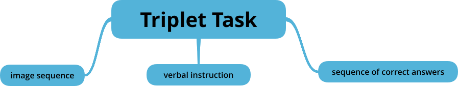
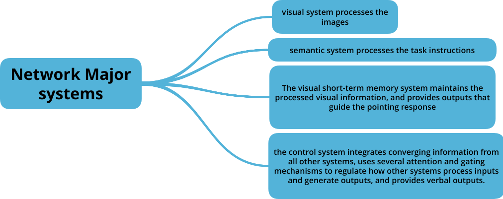
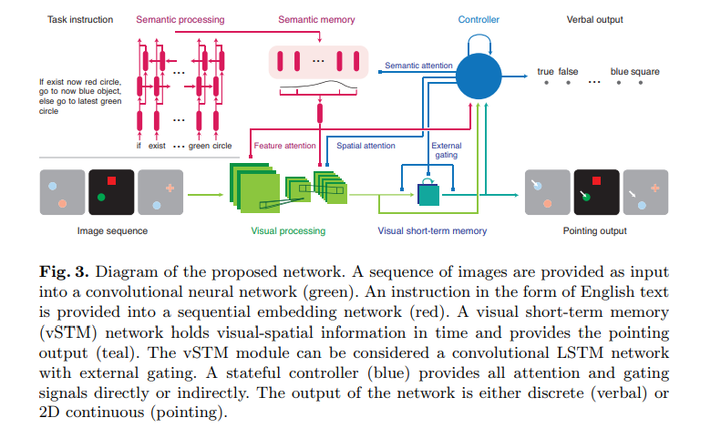
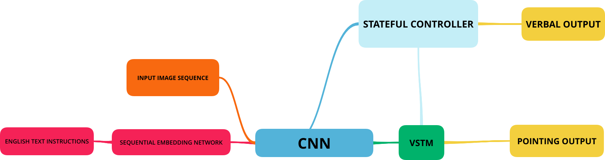

---
<!-- #### A Dataset and Architecture for Visual Reasoning with a Working Memory   -->

##### Link: [Google AI](https://ai.google/research/pubs/pub47145)

##### Paper: [Available here](https://arxiv.org/pdf/1803.06092.pdf)

---

This paper from Google Brain Team was about visual question answering , visual reasoning. This paper addressess the shortcomings of Visual Question Answer(VQA) dataset with additional parametric information such as time and memory.  Additionally, there is a **Reasoning Agent** whose task is as quoted from the paper.

> A reasoning agent must remember relevant pieces of its visual
> history, ignore irrelevant detail, update and manipulate a memory based
> on new information and exploit this memory at later times to make decisions.

An Artificial dataset called [COG](https://github.com/google/cog) that exercises visual reasoning in time was created and used for training this model.

> The COG dataset is based on a programmatic language that builds a battery
> of task triplets: an image sequence, a verbal instruction, and a sequence of correct
> answers.

This model focuses on combining both the **sematic knowledge** and **visual modules**.By employing a **stateful controller** we can harmonize visual attention and memory for correct performance of visual task. 

> Finally, we introduce a multi-modal recurrent architecture for visual reasoning
> with memory. This network combines semantic and visual modules with
> a **stateful controller** that modulates visual attention and memory in order to
> correctly perform a visual task.

Performance outcomes.

>We demonstrate that this model achieves near
>state-of-the-art performance on the CLEVR dataset. In addition, this network
>provides a strong baseline that achieves good performance on the COG dataset
>across an array of settings. 

COG Dataset

> The dataset contains triplets of a task instruction, sequences of synthetic
> images, and sequences of target responses (see Figure 1 for examples). Each
> image consists of a number of simple objects that vary in color, shape, and
> location. There are 19 possible colors and 33 possible shapes (6 geometric shapes
> and 26 lower-case English letters). The network needs to generate a verbal or
> pointing response for every image.

### The network

General network setup

The Network consists of four major syatems.

Network workflow Diagram from the Paper.

---

---

REFERENCE:

1. https://ai.google/research/pubs/pub47145

