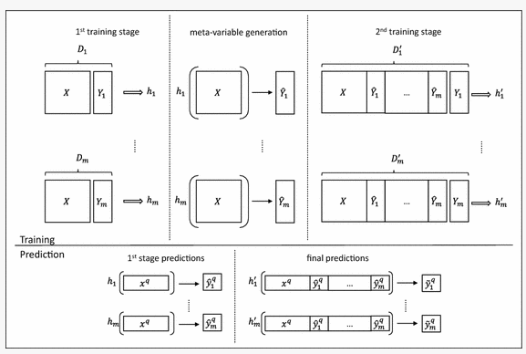
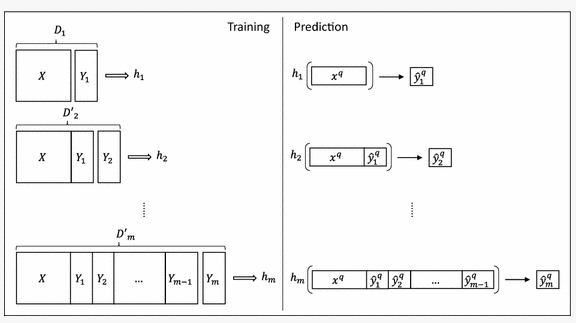

In this blog, lets talk about multi target variables. In a generic machine learning model prediction scenario, where we will have input features and single target variable. 

| Input Feature        | Output Feature |
| -------------------- | -------------- |
| x1 , x2 , x3 , x4... | y              |

Assigning multiple target variables would throw an error on linear regression ,Since it is incompatible with multiple target variable. 

| Input Feature          | Output Feature          |
| ---------------------- | ----------------------- |
| x1 , x2 , x3 , x4..... | y1 , y2 , y3 , y4 ..... |

Linear regression expect the output target variable to be a single value. But in a multiple target variable scenario, it is an array of multiple target variables. Hence it throws an error.

---

#### Random Forest model can predict Multi target Variables

We can use random forest to predict Mutiple target variables. The training methodology and syntax remains identical. The output target will be an array. This array contains multiple target variables to be predicted.   

Theres's a difference in the internal algorithm during multi target than that from single target variable. For this particular example, let's consider a regression problem.

Let's discuss of two method that is:

1.  Stacked single target.

1.  Ensemble of regressor chain.

---

### Stacked Single Target

​				Image from Springer Article by Grigorios Tsoumakas , William Groves , Ioannis Vlahavas 

##### The above image describes how multi target variables are handled in stacked single target approach.

$$
Input \ \ =  X \\ Target \ \  variable \  = [Y_1 , Y_2 ....Y_m]
$$

1. The input variable is trained to predict the first variable Y1 from the Target variable array. This creates a predictor output function h1. 

2. This procedure is carried out on every variable from the target variable array. Their corresponding predictor output functions h1 , h2 ....hm. 

3. Next stage is the meta - variable generation, The input X is passed to the predictor function, which predicts an intermediate value i.e 

$$
   \widehat{Y_1} , \widehat{Y_2} , \widehat{Y_3}  ......\widehat{Y_m}
$$

4. The second training stage takes 

$$
X * \widehat{Y_1} * .....\widehat{Y_m} \ as \  Input \\
Y_1 .......Y_m \ as \ single \ target  \ variable \\
Predicts \ h^{'}_{1} ...........\ h^{'}_{m}  \ respective \  to \  the \  target  \ variable.
$$

5. On the Prediction side, The prediction function is deduced from the first training stage. 

$$
{h_1 , h_2 , h_3 , h_4 .......h_m } \\
$$
Our Prediction input is 
$$
X_q. \\
Then \  h_1(X_q) --> \widehat{y^q_1} \\
$$

6. The number of first prediction stage output will be same as the number of multi target vector.

$$
\{ \widehat{y^q_1} ,\  \widehat{y^q_2} , \  \widehat{y^q_3} , \  \widehat{y^q_4} .....\widehat{y^q_m} \}
$$

7. The final predictions will be 

$$
X_q * \ \widehat{y^q_1} * ...... \widehat{y^q_m} \ as \ Input \\
\widehat{y^q_1} .......\widehat{y^q_m} \ as \ output \\
h^{'}_1 .....  h^{'}_m \ as \ Prediction \ function.
$$

---

### Ensemble of regressor chain

The name suggests, there is a chain pattern in predicting the multi target variable.

######				Image from Springer Article by Grigorios Tsoumakas , William Groves , Ioannis Vlahavas 

 

1. The input features and first target from the multi target array is used as label. The output will be a predictor function.
   $$
   X \ Input \ Feature \\
   Y_1 \ Target \ Variable \\
   h_1 \ Prediction \ function \ for \ Y_1 \\ 
   $$

2. Each target in Multi target array, produce respective prediction function

$$
X \ * \ Y_1 \ Input \ Feature \\
Y_2 \ Target \ Feature \\
h2 \ Prediction \ function \ for \  Y_2 \\
$$

3. On the Prediction side, 
   $$
   x^q \ is \  the \ input \  feature \  during  \ Prediction.
   $$
   Now, with respctive Prediction function i.e 
   $$
   \{ h_1 , h_2 ......h_m\} \\ 
   we \ predict \    \{ \widehat{y^q_1} , \widehat{y^q_2} .......\widehat{y^q_m} \}
   $$

We have unwraped the working of Multi Target Prediction in Machine Learning. Please find the resources below for additive information.

---

Resources:

1. [Slides by Krzysztof Dembczy´nski](http://www.cs.put.poznan.pl/kdembczynski/pdf/multi-target_prediction.pdf)
2. [Springer Post](https://link.springer.com/article/10.1007/s10994-016-5546-z)