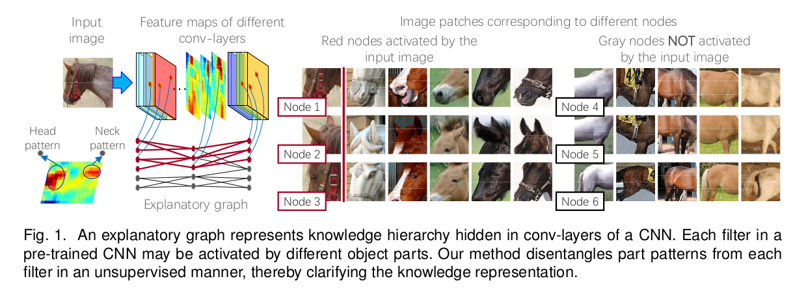
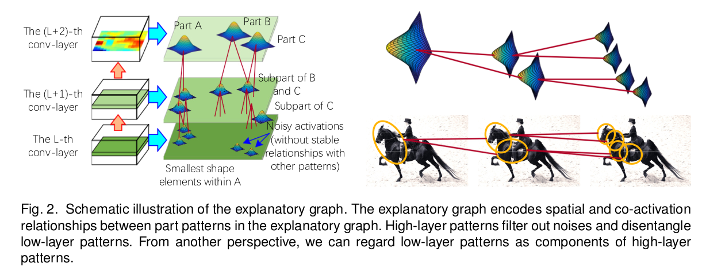
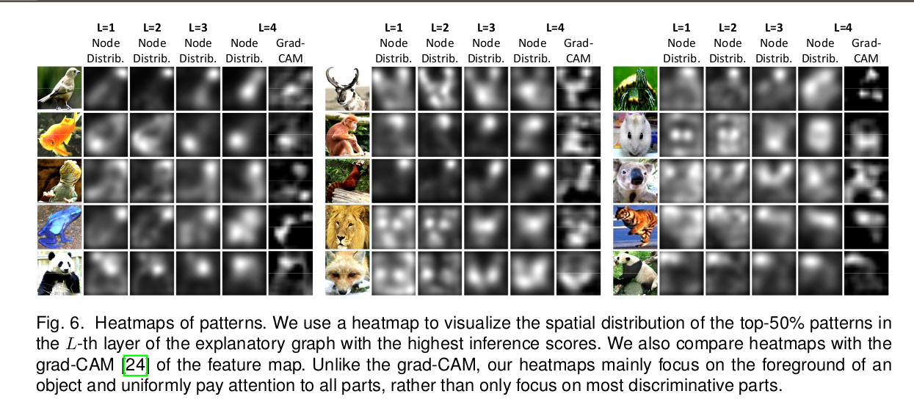
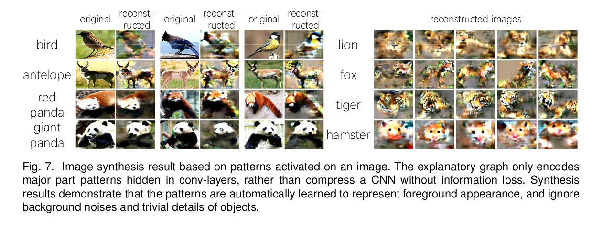
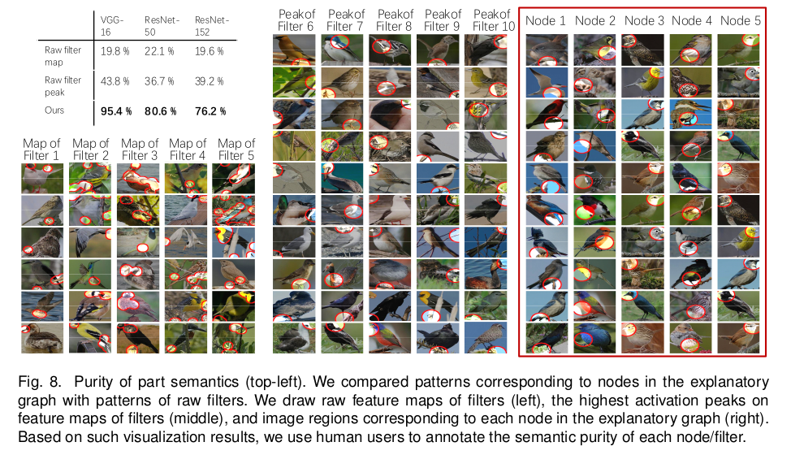
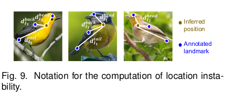
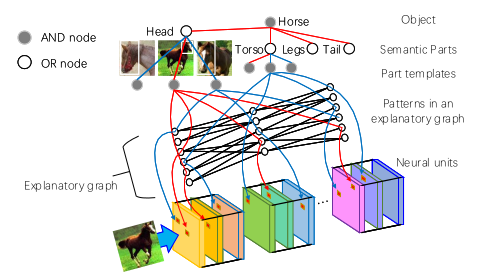

---
layout: post
title: "Understanding CNN"
author: "Karthik"
categories: journal
tags: [documentation,sample]
---

This is a summarization of the [Explanatory Graphs for CNNs](https://arxiv.org/pdf/1812.07997.pdf) paper. 

A graphical model is employed to understand the hierarchial feature representation hidden inside the CNN network which facilitates the classification , localization applications in Deep learning. The feature representation pattern from each filter is extracted to understand using the graphical model which consists of nodes and edges.  

The node in graphical model represent a feature part pattern.  Edges encodes co-activation relationships and spatial relationships between patterns.

---

A pre-trained CNN model is considered for Experiment. The location of each pattern is not fixed to a specific neural activation unit during the inference process. Instead given different input images , a part pattern may appear on various locations of a filter's feature map. But they are co-activated and keep certain spatial relationships.

Given a testing image to the CNN , the exploratory grap-h developed in this paper can infer 

 - Which nodes are responsible for neural activations of a filter.
 - Locations of the corresponding parts on the feature map.

---

**Visualization understanding:**

- For each graph node , we select objects parts that most strongly activate the node for visualization.
- We learn another decoder network to invert activation states of the graph nodes to reconstruct image regions of the nodes.

---

### Algorithm:

1. A single filter is usually activated by different parts of the object.
2. Let us assume that given an input image , a filter is activated by **N** parts   (i.e) there are **N** activation peaks on the filter's feature map. Some peaks represent common parts of the object, which are termed part pattern.
3. Other activation peaks may correspond to background noises or textural patterns.

It is assumed that if an activation peak of a filter represents an object part , then the CNN usually also contains other filters to represent neighboring parts of the target part (i.e)  some activation peaks of the filters must keep certain spatial relationships with the target part.

----

Patterns in high layers usually represent large scale object parts , while patterns in low layers mainly describe small and relatively simple shapes , which can be regarded as components of high layer patterns.  

Patterns in high layers are usually discriminative. Patterns in low layers are disentangled based on their spatial relationship with high layer patterns.

### Experiments:

We designed three experiments to evaluate the explanatory graph from different perspectives. 

- In the first experiment, we visualized node patterns in the explanatory graph. 
- The second experiment was designed to evaluate the interpretability of part patterns, i.e. checking whether or not a node pattern consistently represents the same object part among different
  images. We compared our patterns with three types of middle-level features and neural patterns. 
- In the third experiment, we used our graph nodes for the task of few-shot part localization, in order to test the transferability of node patterns in the graph. We associated part patterns with explicit part names for part localization. We compared our part-localization performance with fourteen baselines.

#### Experiment Images from the paper:

For further information. Please refer the [Paper](https://arxiv.org/pdf/1812.07997.pdf)

---

